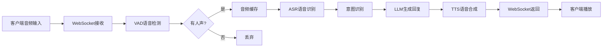

# 小智ESP32语音交互模块抽取方案与技术文档

## 📋 目录
1. [项目现状分析](#项目现状分析)
2. [语音交互架构分析](#语音交互架构分析)
3. [核心模块功能拆解](#核心模块功能拆解)
4. [最小功能集抽取方案](#最小功能集抽取方案)
5. [独立部署架构设计](#独立部署架构设计)
6. [技术实现路线](#技术实现路线)
7. [迁移部署指南](#迁移部署指南)
8. [建议与风险评估](#建议与风险评估)

---

## 1. 项目现状分析

### 1.1 项目整体架构

**xiaozhi-esp32-server** 是一个为ESP32智能硬件提供后端服务的完整解决方案，包含：

```
项目结构:
├── main/manager-api/          # Java后端 - 智控台管理接口
├── main/manager-web/          # Vue前端 - Web管理界面
├── main/manager-mobile/       # 移动端管理界面
└── main/xiaozhi-server/       # Python后端 - 核心语音交互服务
    ├── core/
    │   ├── websocket_server.py    # WebSocket服务器
    │   ├── connection.py          # 连接处理器
    │   ├── providers/             # 各类服务提供者
    │   │   ├── asr/              # 语音识别
    │   │   ├── tts/              # 语音合成
    │   │   ├── llm/              # 大语言模型
    │   │   ├── vad/              # 语音活动检测
    │   │   ├── vllm/             # 视觉模型
    │   │   ├── intent/           # 意图识别
    │   │   └── memory/           # 记忆管理
    │   ├── handle/               # 消息处理器
    │   └── utils/                # 工具类
    ├── config/                   # 配置管理
    └── plugins_func/             # 插件系统
```

### 1.2 核心技术栈

**Python后端核心依赖:**
- `websockets` - WebSocket通信
- `asyncio` - 异步处理
- `funasr` - 本地语音识别
- `silero_vad` - 语音活动检测
- `torch` - 深度学习框架
- `openai` - OpenAI接口调用
- `edge_tts` - 微软TTS
- `opuslib_next` - Opus音频编解码

---

## 2. 语音交互架构分析

### 2.1 完整交互流程



### 2.2 核心模块职责

| 模块 | 功能 | 技术选型 | 是否必需 |
|------|------|----------|----------|
| **VAD** | 语音活动检测 | SileroVAD | ✅ 核心 |
| **ASR** | 语音转文字 | FunASR/阿里云/火山等 | ✅ 核心 |
| **LLM** | 大语言模型 | OpenAI接口/本地部署 | ✅ 核心 |
| **Intent** | 意图识别 | function_call/LLM | ⚠️ 可选 |
| **TTS** | 文字转语音 | EdgeTTS/火山/阿里云等 | ✅ 核心 |
| **Memory** | 对话记忆 | 本地/mem0ai | ⚠️ 可选 |
| **Tools** | 工具调用 | MCP/IOT | ❌ 非必需 |

---

## 3. 核心模块功能拆解

### 3.1 WebSocket服务器 (`websocket_server.py`)

**核心功能:**
- 管理WebSocket连接
- 初始化VAD/ASR/LLM/TTS模块
- 为每个连接创建独立的`ConnectionHandler`

**关键代码结构:**
```python
class WebSocketServer:
    def __init__(self, config):
        self.config = config
        # 初始化核心模块
        modules = initialize_modules(
            vad=True, asr=True, llm=True, ...
        )
        
    async def _handle_connection(self, websocket):
        handler = ConnectionHandler(
            config, vad, asr, llm, memory, intent
        )
        await handler.handle_connection(websocket)
```

### 3.2 连接处理器 (`connection.py`)

**核心职责:**
- 管理单个连接的生命周期
- 处理音频流接收和发送
- 协调各模块的调用
- 维护对话上下文

**关键属性:**
```python
class ConnectionHandler:
    # 音频处理
    self.asr_audio = []              # ASR音频缓存
    self.client_audio_buffer = []    # 客户端音频缓冲
    
    # 状态管理
    self.client_is_speaking = False  # 客户端是否在说话
    self.client_have_voice = False   # 是否检测到语音
    
    # 对话管理
    self.dialogue = Dialogue()       # 对话历史
    self.llm_finish_task = True      # LLM任务完成标志
    
    # 核心模块引用
    self.vad, self.asr, self.tts, self.llm
```

### 3.3 ASR模块 (`core/providers/asr/`)

**接口设计:**
```python
class ASRProviderBase(ABC):
    @abstractmethod
    async def transcribe(self, audio_data: bytes) -> str:
        """语音识别接口"""
        pass
    
    async def handle_voice_stop(self, conn, audio_chunks):
        """处理语音停止事件"""
        # 1. 音频格式转换
        # 2. 调用ASR引擎
        # 3. 返回识别文本
```

**支持的ASR类型:**
- `fun_local` - FunASR本地识别 (推荐)
- `doubao_stream` - 火山引擎流式ASR
- `aliyun_stream` - 阿里云流式ASR
- `openai` - OpenAI Whisper API

### 3.4 TTS模块 (`core/providers/tts/`)

**接口设计:**
```python
class TTSProviderBase:
    def to_tts(self, text: str) -> List[bytes]:
        """文字转语音"""
        # 返回Opus编码的音频数据
        pass
        
    def to_tts_stream(self, text: str):
        """流式TTS (支持的服务)"""
        # 生成器模式返回音频流
        for audio_chunk in audio_stream:
            yield audio_chunk
```

**支持的TTS类型:**
- `edge` - EdgeTTS (免费推荐)
- `linkerai` - 灵犀流式TTS (免费)
- `doubao` - 火山引擎TTS
- `aliyun_stream` - 阿里云流式TTS

---

## 4. 最小功能集抽取方案

### 4.1 方案A: 轻量级独立模块 ⭐推荐

**适用场景:** 在现有后端中添加语音交互能力，不依赖小智的完整生态

**抽取内容:**

```
minimal-voice-module/
├── voice_server.py           # 简化的WebSocket服务器
├── voice_handler.py          # 语音处理核心逻辑
├── providers/
│   ├── asr/
│   │   ├── base.py          # ASR基类
│   │   ├── fun_local.py     # FunASR本地
│   │   └── doubao_stream.py # 流式ASR (可选)
│   ├── tts/
│   │   ├── base.py          # TTS基类
│   │   ├── edge.py          # EdgeTTS (免费)
│   │   └── linkerai.py      # 灵犀TTS (免费)
│   └── vad/
│       └── silero.py        # SileroVAD
├── utils/
│   ├── audio_utils.py       # 音频处理工具
│   └── opus_encoder.py      # Opus编解码
├── config.yaml              # 配置文件
└── requirements.txt         # 依赖列表

核心依赖 (最小化):
- websockets
- funasr (如使用本地ASR)
- silero_vad
- opuslib_next
- edge_tts (如使用EdgeTTS)
- httpx/aiohttp
```

**核心流程简化:**

```python
# voice_handler.py
class VoiceHandler:
    def __init__(self, asr, tts, vad):
        self.asr = asr
        self.tts = tts
        self.vad = vad
        self.audio_buffer = []
        
    async def process_audio(self, audio_chunk):
        """处理音频输入"""
        # 1. VAD检测
        is_speech = self.vad.detect(audio_chunk)
        
        if is_speech:
            self.audio_buffer.append(audio_chunk)
        elif self.audio_buffer:
            # 2. ASR识别
            text = await self.asr.transcribe(self.audio_buffer)
            self.audio_buffer.clear()
            
            # 3. 返回识别结果 (供外部调用API)
            return text
            
    async def text_to_speech(self, text):
        """文字转语音"""
        # 调用TTS生成音频
        audio_data = self.tts.to_tts(text)
        return audio_data
```

**优势:**
- ✅ 代码量小 (~2000行)
- ✅ 依赖少，易部署
- ✅ 可灵活集成到任何Python后端
- ✅ 不依赖数据库和管理台

**劣势:**
- ❌ 需要自行实现LLM集成
- ❌ 缺少意图识别和工具调用
- ❌ 需要自行管理对话上下文

### 4.2 方案B: 中等功能模块

**适用场景:** 需要完整的语音交互能力，包含LLM、意图识别等

**在方案A基础上增加:**
```
+ llm/                        # LLM模块
+ intent/                     # 意图识别
+ memory/                     # 对话记忆
+ handle/                     # 消息处理器
+ connection.py               # 完整的连接处理
```

**核心依赖增加:**
- openai
- requests

**优势:**
- ✅ 功能完整，开箱即用
- ✅ 支持多轮对话
- ✅ 支持意图识别和函数调用

**劣势:**
- ⚠️ 代码量中等 (~5000行)
- ⚠️ 依赖较多

### 4.3 方案C: 完整服务复用

**适用场景:** 新项目与小智场景类似，或作为微服务独立部署

**做法:**
直接部署整个`xiaozhi-server`，通过WebSocket或HTTP接口调用

**优势:**
- ✅ 零开发成本
- ✅ 功能最完整
- ✅ 维护简单

**劣势:**
- ❌ 资源占用较大
- ❌ 配置复杂
- ❌ 可能包含很多用不到的功能

---

## 5. 独立部署架构设计

### 5.1 架构图

```
新项目后端架构:

┌─────────────────────────────────────────┐
│         新项目后端 (FastAPI/Django)       │
│                                         │
│  ┌────────────┐    ┌─────────────────┐ │
│  │  业务API   │───▶│  语音交互模块    │ │
│  └────────────┘    └─────────────────┘ │
│         │                   │           │
│         │                   ▼           │
│         │          ┌─────────────────┐ │
│         │          │   VAD + ASR      │ │
│         │          │   TTS            │ │
│         │          └─────────────────┘ │
│         ▼                               │
│  ┌────────────┐                        │
│  │  LLM接口   │                        │
│  └────────────┘                        │
└─────────────────────────────────────────┘
         │                    │
         ▼                    ▼
   API后端服务          WebSocket客户端
  (处理业务逻辑)       (前端/硬件设备)
```

### 5.2 集成方式

#### 方式1: 嵌入式集成 (推荐)

将语音交互模块作为Python包集成到现有后端:

```python
# main.py (FastAPI示例)
from fastapi import FastAPI, WebSocket
from voice_module import VoiceHandler, initialize_modules

app = FastAPI()

# 初始化语音模块
voice_config = {...}
modules = initialize_modules(voice_config)
voice_handler = VoiceHandler(
    asr=modules['asr'],
    tts=modules['tts'],
    vad=modules['vad']
)

@app.websocket("/voice")
async def voice_endpoint(websocket: WebSocket):
    await websocket.accept()
    
    while True:
        # 接收音频数据
        audio_data = await websocket.receive_bytes()
        
        # ASR识别
        text = await voice_handler.process_audio(audio_data)
        
        if text:
            # 调用你的业务API
            response = await your_api_call(text)
            
            # TTS合成
            audio = await voice_handler.text_to_speech(response)
            
            # 返回音频
            await websocket.send_bytes(audio)
```

#### 方式2: 独立服务集成

将语音模块部署为独立服务，通过API调用:

```python
# 语音服务 (端口8001)
# voice_service.py
from fastapi import FastAPI, UploadFile

app = FastAPI()

@app.post("/asr")
async def asr_endpoint(audio: UploadFile):
    """语音识别接口"""
    audio_data = await audio.read()
    text = await asr_provider.transcribe(audio_data)
    return {"text": text}

@app.post("/tts")
async def tts_endpoint(text: str):
    """语音合成接口"""
    audio = await tts_provider.to_tts(text)
    return audio

# 主业务后端 (端口8000)
# main.py
import httpx

async def voice_to_api(audio_data):
    # 1. 调用ASR服务
    async with httpx.AsyncClient() as client:
        response = await client.post(
            "http://localhost:8001/asr",
            files={"audio": audio_data}
        )
        text = response.json()["text"]
    
    # 2. 提取关键信息 (你的业务逻辑)
    params = extract_params_from_text(text)
    
    # 3. 调用API
    result = await your_business_api(params)
    
    # 4. 调用TTS服务
    async with httpx.AsyncClient() as client:
        audio_response = await client.post(
            "http://localhost:8001/tts",
            json={"text": result}
        )
        return audio_response.content
```

---

## 6. 技术实现路线

### 6.1 快速实施路线图

**Phase 1: 核心抽取 (1-2天)**
1. 复制核心文件到新模块
   ```bash
   # 必需文件
   core/providers/asr/base.py
   core/providers/asr/fun_local.py
   core/providers/tts/base.py
   core/providers/tts/edge.py
   core/providers/vad/silero.py
   core/utils/audio_utils.py
   core/utils/opus_encoder_utils.py
   ```

2. 简化配置系统
   ```yaml
   # minimal_config.yaml
   asr:
     type: fun_local
     model_dir: ./models/asr
   
   tts:
     type: edge
     voice: zh-CN-XiaoxiaoNeural
   
   vad:
     type: silero
     threshold: 0.5
   ```

3. 创建简化的处理器
   ```python
   # simple_voice_handler.py
   ```

**Phase 2: 集成测试 (1天)**
1. 编写单元测试
2. 测试ASR准确率
3. 测试TTS音质
4. 测试端到端流程

**Phase 3: 业务集成 (2-3天)**
1. 实现参数提取逻辑
2. 对接现有API
3. 错误处理和日志
4. 性能优化

**Phase 4: 部署上线 (1天)**
1. Docker化
2. 配置生产环境
3. 监控告警

### 6.2 参数提取示例

```python
# param_extractor.py
import re
from typing import Dict, Any

class ParamExtractor:
    """从语音识别文本中提取API参数"""
    
    def extract_booking_params(self, text: str) -> Dict[str, Any]:
        """
        示例: 从"我想预订明天下午3点的会议室"提取参数
        """
        params = {}
        
        # 时间提取
        time_patterns = {
            r'明天': lambda: get_tomorrow(),
            r'后天': lambda: get_day_after_tomorrow(),
            r'(\d+)点': lambda m: f"{m.group(1)}:00"
        }
        
        for pattern, extractor in time_patterns.items():
            match = re.search(pattern, text)
            if match:
                params['time'] = extractor() if callable(extractor) else extractor(match)
        
        # 资源提取
        if '会议室' in text:
            params['resource_type'] = 'meeting_room'
        elif '车辆' in text:
            params['resource_type'] = 'vehicle'
            
        return params
    
    def extract_query_params(self, text: str) -> Dict[str, Any]:
        """
        示例: 从"查询最近7天的销售数据"提取参数
        """
        params = {}
        
        # 数字提取
        num_match = re.search(r'(\d+)天', text)
        if num_match:
            params['days'] = int(num_match.group(1))
        
        # 类型提取
        if '销售' in text:
            params['type'] = 'sales'
        elif '库存' in text:
            params['type'] = 'inventory'
            
        return params
```

---

## 7. 迁移部署指南

### 7.1 依赖安装

```bash
# 创建虚拟环境
python -m venv venv
source venv/bin/activate  # Windows: venv\Scripts\activate

# 最小依赖 (方案A)
pip install websockets==14.2
pip install silero_vad==6.0.0
pip install opuslib_next==1.1.2
pip install numpy==1.26.4
pip install pydub==0.25.1
pip install edge_tts==7.0.0  # 如使用EdgeTTS

# 如使用本地ASR
pip install funasr==1.2.3
pip install torch==2.2.2
pip install torchaudio==2.2.2

# 如使用API调用
pip install httpx==0.27.2
pip install aiohttp==3.12.15
```

### 7.2 Docker部署

```dockerfile
# Dockerfile
FROM python:3.10-slim

WORKDIR /app

# 安装系统依赖
RUN apt-get update && apt-get install -y \
    ffmpeg \
    libopus0 \
    && rm -rf /var/lib/apt/lists/*

# 安装Python依赖
COPY requirements.txt .
RUN pip install --no-cache-dir -r requirements.txt

# 复制代码
COPY voice_module/ ./voice_module/
COPY config.yaml .

# 下载模型 (如使用本地ASR)
RUN python -c "from funasr import AutoModel; AutoModel(model='paraformer-zh')"

EXPOSE 8000

CMD ["python", "voice_module/voice_server.py"]
```

```yaml
# docker-compose.yml
version: '3.8'

services:
  voice-service:
    build: .
    ports:
      - "8001:8000"
    volumes:
      - ./config.yaml:/app/config.yaml
      - ./models:/app/models
    environment:
      - LOG_LEVEL=INFO
    restart: unless-stopped
```

### 7.3 配置示例

```yaml
# config.yaml - 最小配置
server:
  host: 0.0.0.0
  port: 8000

# VAD配置
vad:
  type: silero
  threshold: 0.5
  min_speech_duration_ms: 250
  max_speech_duration_s: 30

# ASR配置 - 方案1: 本地FunASR (无需API密钥)
asr:
  type: fun_local
  model: paraformer-zh  # 支持中文
  device: cpu  # 或 cuda
  
# ASR配置 - 方案2: 火山引擎流式ASR
# asr:
#   type: doubao_stream
#   api_key: "your_api_key"
#   app_id: "your_app_id"

# TTS配置 - 方案1: EdgeTTS (完全免费)
tts:
  type: edge
  voice: zh-CN-XiaoxiaoNeural  # 晓晓
  rate: "+0%"
  volume: "+0%"

# TTS配置 - 方案2: 灵犀流式TTS (免费)
# tts:
#   type: linkerai
#   voice: BV001_streaming
#   speed: 1.0

# 音频配置
audio:
  format: opus
  sample_rate: 16000
  channels: 1
  frame_duration: 60

# 日志配置
logging:
  level: INFO
  file: logs/voice_module.log
```

---

## 8. 建议与风险评估

### 8.1 推荐方案

**根据您的需求，我强烈推荐采用 "方案A + 独立服务集成":**

**理由:**
1. ✅ **低耦合:** 语音模块与业务逻辑分离，易于维护
2. ✅ **可复用:** 一个语音服务可以服务多个业务系统
3. ✅ **易扩展:** 可以随时切换ASR/TTS提供商
4. ✅ **快速上手:** 核心代码不超过3000行
5. ✅ **成本可控:** 可以选择完全免费的方案 (FunASR + EdgeTTS)

### 8.2 最小部署配置推荐

```
推荐配置:
- CPU: 2核 (如使用API)/ 4核 (如使用本地FunASR)
- 内存: 2GB (如使用API)/ 4GB (如使用本地FunASR)
- 存储: 10GB (模型文件约2-3GB)
- 网络: 需要外网访问 (如使用云服务API)

性能指标:
- ASR延迟: 500-800ms (本地) / 300-500ms (云API)
- TTS延迟: 200-500ms (EdgeTTS) / 100-300ms (流式TTS)
- 并发能力: 5-10个连接 (取决于硬件)
```

### 8.3 技术风险

| 风险点 | 严重程度 | 应对措施 |
|--------|----------|----------|
| ASR识别准确率 | ⚠️ 中 | 使用商用API (火山/阿里云) 提高准确率 |
| 音频格式兼容 | ⚠️ 中 | 统一使用Opus格式，兼容性强 |
| 网络延迟 | ⚠️ 中 | 优先使用流式处理降低延迟感知 |
| 并发性能 | 🔴 高 | 使用异步处理 + 限流策略 |
| 模型加载慢 | ⚠️ 中 | 提前预热模型，使用模型缓存 |

### 8.4 实施建议

**建议分三步走:**

**第一步 (1周):** 快速验证
- 抽取最小功能集 (ASR + TTS + VAD)
- 搭建Demo环境
- 验证识别准确率和延迟
- 评估是否满足业务需求

**第二步 (2周):** 业务集成
- 开发参数提取逻辑
- 对接现有API
- 完善错误处理
- 编写单元测试

**第三步 (1周):** 优化上线
- 性能调优
- 部署生产环境
- 监控告警
- 编写文档

### 8.5 成本预估

**方案对比:**

| 方案 | 初期开发 | 运营成本/月 | 说明 |
|------|----------|-------------|------|
| 本地FunASR + EdgeTTS | 3-5天 | ¥0 | 完全免费，需要GPU加速 |
| 本地FunASR + 商用TTS | 3-5天 | ¥50-200 | TTS按量计费 |
| 云ASR + 云TTS | 2-3天 | ¥200-500 | 全部按量计费，延迟最低 |
| 复用xiaozhi-server | 1天 | ¥0-200 | 快速但定制性差 |

---

## 9. 快速开始示例

### 9.1 最简实现 (100行代码)

```python
# minimal_voice_service.py
import asyncio
import websockets
from funasr import AutoModel
import edge_tts
import io

# 初始化ASR
asr_model = AutoModel(model="paraformer-zh")

# 初始化TTS
async def text_to_speech(text):
    communicate = edge_tts.Communicate(text, "zh-CN-XiaoxiaoNeural")
    audio_data = b""
    async for chunk in communicate.stream():
        if chunk["type"] == "audio":
            audio_data += chunk["data"]
    return audio_data

# WebSocket处理
async def handle_client(websocket):
    audio_buffer = []
    
    async for message in websocket:
        if isinstance(message, bytes):
            # 音频数据
            audio_buffer.append(message)
        elif message == "END":
            # 语音结束，进行识别
            audio_data = b"".join(audio_buffer)
            
            # ASR识别
            result = asr_model.generate(audio_data)
            text = result[0]["text"]
            
            # 这里对接你的API
            response = your_api_call(text)
            
            # TTS合成
            audio = await text_to_speech(response)
            
            # 返回音频
            await websocket.send(audio)
            
            # 清空缓存
            audio_buffer.clear()

# 启动服务
async def main():
    async with websockets.serve(handle_client, "0.0.0.0", 8000):
        print("Voice service started on ws://0.0.0.0:8000")
        await asyncio.Future()

if __name__ == "__main__":
    asyncio.run(main())
```

### 9.2 测试客户端

```python
# test_client.py
import asyncio
import websockets
import wave

async def test_voice_service():
    # 读取测试音频
    with wave.open("test.wav", "rb") as wf:
        audio_data = wf.readframes(wf.getnframes())
    
    # 连接服务
    async with websockets.connect("ws://localhost:8000") as ws:
        # 发送音频
        await ws.send(audio_data)
        await ws.send("END")
        
        # 接收结果
        response_audio = await ws.recv()
        
        # 保存结果
        with open("response.wav", "wb") as f:
            f.write(response_audio)
        
        print("语音响应已保存到 response.wav")

asyncio.run(test_voice_service())
```

---

## 10. 总结

### 核心要点

1. **xiaozhi-esp32-server的语音交互模块设计优秀**
   - 模块化架构，职责清晰
   - 支持多种ASR/TTS提供商
   - 流式处理降低延迟

2. **完全可以抽取最小功能集**
   - 核心代码不超过3000行
   - 依赖清晰，易于部署
   - 可以只保留VAD+ASR+TTS

3. **推荐实施路径**
   - 先抽取最小功能集验证
   - 采用独立服务架构
   - 使用免费方案降低成本 (FunASR + EdgeTTS)

4. **关键技术**
   - WebSocket实现实时通信
   - VAD检测语音端点
   - 异步处理提高并发
   - Opus音频编码降低带宽

### 下一步行动

1. **立即可做:**
   - 克隆xiaozhi-esp32-server仓库
   - 按照本文档抽取核心文件
   - 搭建最小Demo验证效果

2. **需要决策:**
   - 选择ASR方案 (本地 vs 云API)
   - 选择TTS方案 (免费 vs 商用)
   - 选择集成方式 (嵌入 vs 独立服务)

3. **资源准备:**
   - 申请云服务API密钥 (如需要)
   - 准备测试音频数据
   - 搭建开发环境

---

## 附录

### A. 核心文件清单

**必须抽取的文件 (方案A - 最小功能集):**
```
core/providers/asr/base.py
core/providers/asr/fun_local.py
core/providers/tts/base.py
core/providers/tts/edge.py
core/providers/vad/silero.py
core/utils/audio_utils.py
core/utils/opus_encoder_utils.py
```

**可选文件 (方案B - 完整功能):**
```
+ core/connection.py
+ core/handle/receiveAudioHandle.py
+ core/handle/sendAudioHandle.py
+ core/providers/llm/base.py
+ core/providers/intent/function_call.py
+ core/providers/memory/mem_local_short.py
+ core/utils/dialogue.py
+ core/utils/textUtils.py
```

### B. 参考资源

- **项目文档:** https://github.com/xinnan-tech/xiaozhi-esp32-server
- **部署教程:** docs/Deployment.md
- **性能测试:** docs/performance_tester.md
- **FunASR文档:** https://github.com/alibaba-damo-academy/FunASR
- **EdgeTTS文档:** https://github.com/rany2/edge-tts

---

**文档版本:** v1.0  
**最后更新:** 2025-09-30  
**作者:** AI技术顾问
